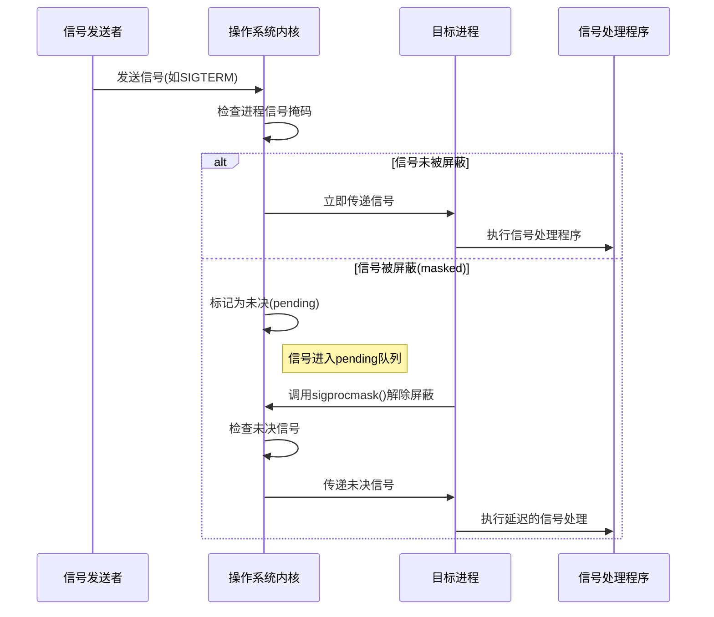

# 进程

## 1.基本知识

* 进程标识符pid
* 进程的产生

## 


# system-V的IPC对象

## 1.MSG（消息队列）


# 并发

同步：顺序执行，任务之间强耦合，线性，可预测

异步：独立执行，任务间弱耦合，事件的到来和结果不可知，非线性，事件驱动

异步事件的处理：查询法，通知法。

## 一、信号

#### 1.概念

信号是软件中断，指示进程发生了某种特定事件，

每个信号都有一个唯一的编号和名称，

信号的响应依赖于中断。


* 每个线程都使用一个PCB(即`task_struct`)来表示，因此`pending`(不是指针)就是一个线程单独私有的，当使用`pthread_kill()`给指定线程发送信号时，信号就会被存储在这个链队列中
* `signal`是一个指向线程共享的信号挂起队列相关结构体的指针，一个线程组（即一个进程）中的所有线程的`signal`指针都指向同一个结构体，当给一个进程发送某信号时，这些信号将会被存储在`shared_pending`这个线程共享的链队列中

​		如果一个进程中有超过 1 条线程，那么这些共享的挂起信号将会被**随机的某条线程**响应，为了能确保让一		个指定的线程响应来自进程之外、发送给整个进程的某信号，一般的做法是：除了指定要响应某信号的线		程外，其他线程对这些信号设置阻塞。（使用`sigprocmask()`或`pthread_sigmask()`将这些需要阻塞的		信号添加到信号阻塞掩码 blocked 当中）    

* `sighand` 也是一个指针，因此也是进程中的所有线程共享的，它指向跟信号响应函数相关的数据结构，结构体 `struct sighand_struct{}`中的数组 action 有 64 个元素，一一对应 Linux系统支持的 64 个信号（其中 0 号信号是测试用的，32 号和 33 号信号保留）。每一个元素是一个 `sigaction{}`结构体，其成员就是标准 C 库函数 `sigaction()`中的第二个参数的成员，可见，该函数相当于一个应用层给内核设置信号响应策略的窗口。

#### 2.`signal()`

* 注册当前信号的行为

* **信号会打断阻塞的系统调用**

  当程序执行一个阻塞的系统调用（如`read()`,`write()`,`sleep()`等时，如果此时进程收到一个未被忽略的信号，系统调用可能会被中断，并设置`errno`为`EINTER`

  * 处理`EINTER`

    * 自动重启被中断的系统调用

      ```c
      struct sigaction sa;
      sa.sa_handler = handler;
      sa.sa_flags = SA_RESTART;  // 自动重启被中断的系统调用
      sigemptyset(&sa.sa_mask);
      sigaction(SIGALRM, &sa, NULL);
      ```

      

    * 手动重试被中断的系统调用

      ```c
      // 手动重试 read()
      ssize_t n;
      do {
          n = read(fd, buf, size);
      } while (n == -1 && errno == EINTER);
      
      if (n == -1) {
          // 处理其他错误
          perror("read failed");
          exit(1);
      }
      ```

      

```c
#include <signal.h>
void (*signal(int signo, void (*func)(int)))(int)
```

**参数部分**

```c
signal(int signo, void (*func)(int))
```

`int signo`:要捕获的信号编号（如`SIGINT`、`SIGTERM`等）

`void (*func) (int)`:指向信号处理函数的指针，该函数接收一个`int`参数（信号编号），返回`void`

`func`的值是

* 常量`SIG_IGN`(向内核表示忽略该信号，但`SIGKILL`和`SIGSTOP`不能忽略),
* 常量`SIG_DFL`（系统默认动作）
* 接收到此信号后要调用的函数的地址

**返回值部分**

```c
void(* ... )(int)
```

* `signal()`的返回值是一个函数指针，指向一个接收`int`参数，返回`void`的函数
* 这个返回值实际上是之前的信号处理函数（用于恢复默认行为或链式处理）。

**简化理解**

```c
 #include <signal.h>

 typedef void (*sighandler_t)(int);
 sighandler_t signal(int signum, sighandler_t handler);
```


#### 3.信号的不可靠

信号的行为不可靠

* 当多个不同信号同时到达时，内核处理信号的顺序没有明确规范（依赖具体系统实现）
* 信号处理函数执行时，进程可能处于任意状态，可能打断正常逻辑。比如，处理信号时修改了主程序正在操作的全局变量，导致数据不一致
* 系统调用被中断
* 所以，仅将信号用于简单的异步通知，复杂的进程间通信应使用更可靠的机制（套接字，共享内存等）

#### 4.可重入函数

在执行过程中可以被安全中断并再次调用的函数

**可重入**：

* 函数在执行过程中被中断，并在中断返回后继续执行时，不会出现数据不一致或未定义行为
* 核心条件：
  1. **不依赖全局变量或静态数据**：所有数据都由参数传递或局部变量存储。
  2. **不修改自身代码**：函数体在执行期间保持不变。
  3. **不调用不可重入的函数**：避免调用标准库中的非线程安全函数（如`malloc`、`printf`）。

所有的系统调用都是可重入的，一部分库函数也是可重入的


#### 5.信号的响应过程

信号从收到到响应有一个不可避免的延迟

1. **信号的产生**

* 硬件异常
* 软件事件
* 内核通知

2. **信号的注册**

​	信号产生后，内核会为目标进程注册信号

* 信号掩码（Signal Mask）检查

  *  内核首先检查目标进程的阻塞掩码（Blocked Mask），该掩码存储了被进程暂时阻塞的信号（通过`sigprocmask()`设置）

  * 若信号被阻塞：信号不会立即递送，而是在内核中被标记为“pending”（待处理），直到掩码接触

  * 若信号未被阻塞：进入下一步

* 信号队列处理
  * 非实时信号：内核使用一个位图（每位对应一个信号）记录信号是否到达。若同一非实时信号多次发送，仅记录依次（后续信号丢失）
  * 实时信号：内核维护一个信号队列，相同信号可按发送顺序排队，不会丢失（队列长度受系统限制）

3. **信号的递送**

   当以下信号满足条件时，内核将信号递送给目标进程

   * 信号未被阻塞
   * 进程从内核态返回用户态

   **信号递送时的关键操作**

   * 内核修改进程的上下文，准备执行信号处理逻辑
   * 若进程设置了自定义信号处理函数，控制权将转移至该函数；否则执行默认动作

4. **信号的处理**

   信号到达后，进程根据信号处置执行相应操作

   * 默认动作
   * 忽略信号
   * 捕获并处理

5. 信号处理函数的执行流程

   1. 进程从用户态切换到内核态。

   2. 内核保存当前上下文（如寄存器值）。

   3. 内核设置栈帧，准备执行处理函数。

   4. 控制权转移至用户态的信号处理函数。

   5. 处理函数执行完毕后，通过 `sigreturn()` 系统调用返回内核态。

   6. 内核恢复原始上下文，进程继续执行被中断的代码。




* **如何忽略掉一个信号**(`SIG_IGN`)

* **标准信号为什么要丢失**

* 标准信号的响应没有严格的顺序

  

#### 6.常用函数

* ##### `kill()`

  向指定进程或进程组发送信号

  需要权限：发送者的有效用户ID需匹配目标进程的真实/有效用户ID（或特权进程）。例如，普通用户无法向其他用户的进程发送信号（`ERERM`）

* ##### `raise()`

  允许进程向自身发送信号，`raise(signo)`等价于调用`kill(getpid(), signo)`

  ```c
  #include <signal.h>
  int kill (pid_t pid, int signo);
  int raise(int signo);
  ```

  * `pid`>0: 将该信号发送给进程ID为`pid`的进程
  * `pid` == 0:将该信号发送给与发送进程属于同一进程组的所有进程（这些进程的进程组ID等于发送进程的进程组ID）
  * `pid`=-1:发送给系统有权发送的所有进程（需要权限）
  * `pid<-1`:发送给进程组ID为`|pid|`的所有进程
  * `signo` 信号编号（如`SIGTERM`,`SIGKILL`,`SIGUSR1`),若为0，则不发送信号，仅检查权限
  * 成功时返回0，失败时返回-1并设置`errno`


* ##### `alarm()`

  设置一个定时器，在指定秒数后向当前进程发送`SIGALRM`信号

  * 每个进程只能有一个`alarm`定时器
  * 定时器到期时，内核向进程发送`SIGALRM`信号（默认行为时终止进程）
  * 可以通过`signal()`或`sigaction()`捕获信号自定义处理

  ```c
  #include <unistd.h>
  unsigned int alarm(unsigned int seconds);
  ```

  * `seconds`定时器的时间（秒）
    * 值为0：取消之前设置的定时器
    * 值>0:设置新的定时器（覆盖旧定时器）
  * 返回上一个定时器的剩余秒数（若之前没有定时器则返回0）

* ##### `pause()`

  挂起调用进程，直到任何信号到达，即使时被忽略的信号

  使程序进入可中断睡眠状态（睡眠直到捕获信号）

  ```c
  #include<unistd.h>
  int pause(void)
  ```

  * 返回值始终使-1，且errno设为`EINTR`(表示被信号中断)
  * 当信号处理函数返回后，`pause`才返回

​	`alarm`和`pause`常结合使用实现超时等待

​	

​	

* ##### `abort()`

  立即终止程序执行，触发`SIGABRT`（可捕获但最终仍会终止）,生成核心转储(core dump), 并向操作系统返回异常退出状态

  一旦调用。程序立即终止，不会返回到调用点

  

  ```c
  #include <stdlib.h>
  void abort(void);
  ```

  ```mermaid
  graph LR
  A[调用 abort] --> B[发送 SIGABRT 信号]
  B --> C{是否有自定义<br>信号处理函数?}
  C -->|有| D[执行自定义处理函数]
  C -->|无| E[执行默认行为]
  D --> F[是否返回?]
  F -->|是| G[再次发送 SIGABRT]
  F -->|否| H[终止程序]
  E --> H[终止程序]
  H --> I[生成 core dump]
  I --> J[返回失败状态]
  ```

  

  

* ##### `system()`

  在程序中执行操作系统命令（shell命令）

  ```c
  #include <stdio.h>
  int system(const char* command);
  ```

  * `command`:要执行的命令字符串

    * 如果为`NULL`，检查系统是否支持命令处理器
    * 如果为有效命令，执行指定的命令

  * | 返回值 | 含义                                        |
    | :----- | :------------------------------------------ |
    | 0      | 命令处理器可用（当 `command` 为 `NULL` 时） |
    | -1     | 创建新进程失败                              |
    | 127    | 无法执行 shell                              |
    | 其他值 | 命令的退出状态（通常是命令返回的状态码）    |

    

* ##### `sleep()`

  使当前线程/进程暂停执行一段指定时间（在POSIX中，使整个进程休眠）

  ```c
  #include <unistd.h>
  unsigned int sleep(unsigned int seconds);/*seconds:休眠的秒数*/
  ```

  返回值：

  *  0：成功休眠指定时间
  * 剩余秒数：如果被信号中断，返回未休眠完的时间

  

#### 7.信号集

`sigset_t`类型的数据结构，表示一组信号的集合

```c
typedef struct {
    unsigned long sig[_NSIG_WORDS];
} sigset_t;
```

* 本质是位掩码（bitmask）,每个信号对用一个位
* 信号编号作为位索引（如SIGINT对应位2）

| 函数          | 原型                                               | 功能             | 返回值                    |
| :------------ | :------------------------------------------------- | :--------------- | :------------------------ |
| `sigemptyset` | `int sigemptyset(sigset_t *set)`                   | 清空信号集       | 成功:0, 失败:-1           |
| `sigfillset`  | `int sigfillset(sigset_t *set)`                    | 包含所有信号     | 同上                      |
| `sigaddset`   | `int sigaddset(sigset_t *set, int signum)`         | 添加指定信号     | 同上                      |
| `sigdelset`   | `int sigdelset(sigset_t *set, int signum)`         | 移除指定信号     | 同上                      |
| `sigismember` | `int sigismember(const sigset_t *set, int signum)` | 检查信号是否存在 | 存在:1, 不存在:0, 错误:-1 |

#### 8.信号屏蔽字/pending集的处理

​	**核心概念**

* **信号掩码（Signal Mask）**
  * 每个进程拥有的一个位掩码(bitmask),指定当前被阻塞的信号集合

  * 操作：
    * `sigprocmask()`：设置或修改进程的信号掩码
    * `pthread_sigmask()`：线程级别的信号掩码操作

* **未决信号（Pending Signals）**

  * 已经发送给进程但尚未被处理的信号

**信号屏蔽（阻塞）**

```c
#include<signal.h>
int sigprocmask(int how, const sigset_t* set, sigset_t* oldset);
```

* `how` 操作类型
  * `SIG_BLOCK`将`set`中的信号添加到当前阻塞集
  * `SIG_UNBLOCK`:从当前阻塞集中移除`set`中的信号
  * `SIG_SETMASK`:将当前阻塞集替换为`set`
* `set`：要操作的信号集
* `oldset`保存原阻塞集

**获取未决信号**

```c
#include <signal.h>

int sigpending(sigset_t *set);
```


#### 9.扩展

* `sigsuspend()`

  **安全信号等待**， 使用场景:原子操作（避免竞态条件）

  ```c
  #include <signal.h>
  
  int sigsuspend(const sigset_t *mask);
  ```

  

* `sigaction()`

  信号处理函数注册

  ```c
  #include <signal.h>
  
  int sigaction(int signum, const struct sigaction *act, 
               struct sigaction *oldact);
  ```

  `sigaction`结构

  ```c
  struct sigaction {
      void     (*sa_handler)(int);         // 简单处理函数
      void     (*sa_sigaction)(int, siginfo_t *, void *); // 高级处理函数
      sigset_t sa_mask;                    // 执行处理时阻塞的信号
      int      sa_flags;                   // 标志位
      void     (*sa_restorer)(void);       // 已废弃
  };
  ```

  

* `setitimer()`

  设置高精度间隔定时器的系统调用，相比`alarm()`提供更精细的时间控制和多种定时器类型

  ```c
  #include <sys/time.h>
  
  int setitimer(int which, /*定时器类型*/
                const struct itimerval *new_value,/*新定时器设置*/
                struct itimerval *old_value);/*原定时器设置,设为 NULL 表示不获取原设置,非 NULL 时返回当前定时器设置*/
  ```

  **三种定时模式**(`which`)

  * `ITIMER_REAL`：真实时间（最常用）
  * `ITIMER_VIRTUAL`：用户态CPU时间
  * `ITIMER_PROF`：总CPU时间（用户+内核）

  **`new_value`**

  ```c
  struct itimerval {
      struct timeval it_interval; /* 间隔时间 */
      struct timeval it_value;    /* 初始到期时间 */
  };
  
  struct timeval {
      time_t      tv_sec;         /* 秒 */
      suseconds_t tv_usec;        /* 微秒 */
  };
  ```

  成功返回0， 失败返回-1，并设置`errno`

#### 10.实时信号

## 二、线程

#### 1.概念

* 线程是一个正在运行的函数，多核处理器下操作系统可以将多个线程调度到不同的CPU中实现并行加速

* 线程是一种轻量级进程，依附于进程存在，进程中至少有一个线程。


* 系统分配资源的最小单位:进程；系统调度的最小单位：线程。


* 进程就像一个容器，容器承载多个线程。进程为线程提供资源环境，线程是进程的运行时。
* 线程之间共享地址空间和进程资源，且其本身拥有独立的PCB，

注：

1.posix线程是一套标准，而不是具体实现。比如线程标识：`pthread_t`，这只是一个标识，具体是结构体还是整形数，由开发者自己实现。

编译时需要在makefile加上选项(GCC进行默认编译时不用)

```
CFLAGES+=-pthread
LDFLAGS+=-pthread
```

2.线程的ID用`pthread_t`类型表示

```
pthread_equal();//比较线程标识
pthread_self(); //返回当前线程标识
```

3.现代主流操作系统中，线程和进程实现已经明确分离，但在Linux中，`clone()`系统调用是更底层的实现，`fork()`和线程创建都基于`clone()`,但传递不同的标志参数。


#### 2.创建，终止，栈的清理，取消选项

所有以`pthread_xxx`开头的线程函数，成功一律返回0，失败一律返回错误码


##### 1）创建线程

* 创建函数

```c
#include <pthread.h>
int pthread_create(pthread_t *thread, /*线程标识*/
					const pthread_attr_t *attr,   /*线程属性*/
					void *(*start_routine)(void *) /*线程函数*/
					void *arg /* 线程函数的参数*/) 
```

* 线程的调度取决于调度器策略，主线程推出后其他线程也会一并退出。


##### 2)线程的终止

* 线程从启动例程返回，返回值就是线程的退出码

* 线程可以从被同一进程中的其他线程取消

* 线程调用`pthread_exit();`

  * 如果任意线程调用了`exit`，那整个进程将会终止。

  * ```c
    #include <pthread.h>
    void pthread_exit(void *rval_ptr);/*rval_ptr:指向任意类型数据作为返回值*/
    ```

* `pthread_join()`和`pthread_detach()`

  * ```c
    #include <pthread.h>
    int pthread_join(pthread_t thread, void **retval);/*阻塞某个线程直到本线程结束，返回值存储在rval_ptr*/
    int pthread_detach(pthread_t thread);/*分离指定线程，此线程推出后自动释放资源而不会造成其他线程的阻塞*/
    ```

##### 4）栈的清理

线程退出时可以指定析构函数，并且可以以栈的方式指定多个析构函数及其执行顺序

```c
#include <pthread.h>

void pthread_cleanup_push(void (*routine)(void *), void *arg);
void pthread_cleanup_pop(int execute);
```

`push`:压入一个析构函数`routine`,参数时`arg`

`pop`:`execute`为1时使对应顺序的函数生效，为0时使之无效

两个函数实际是由宏来实现的，并且`push`展开后包含`{`，`pop`展开后包含`}`，故`push`和`pop`之间可以包含任意代码，但要求必须成对出现，否则会报错花括号未闭合

##### 4）取消选项

线程之间可以借助函数来取消某个线程

```c
#include <pthread.h>

int pthread_cancel(pthread_t thread);/*发送取消信号给指定线程*/ 
int pthread_setcancelstate(int state, int *oldstate);/*设置此线程是否允许取消*/
int pthread_setcanceltype(int type, int *oldtype);/*设置取消的方式，如异步，推迟等*/
void pthread_testcancel(void);/*在本位置设置一个取消点*/
```


```c
#include <stdio.h>
#include <pthread.h>

static void* func(void* p){
    puts("Thread is working!");
    pthread_exit(NULL);
    return NULL;
}

int main(){
	pthread_t tid;
    int err;
    puts("Begin!");
    err = pthread_create(&tid, NULL, func, NULL);
    if(err){
        fprintf(stderr, "pthread_create():%s\n", strerror(err));
        exit(1);
    }
    puts("End!");
    exit(0);
	
}
```


#### 3. 同步互斥

#### 1）互斥锁与读写锁

* 互斥是控制两个进度使之互相排斥，不同时运行

* 同步是控制两个进度使之有先有后，次序可控

  #### 互斥锁

* ##### 创建, 初始化与销毁

  ```c
  #include <pthread.h>
  pthread_mutex_t mutex = PTHREAD_MUTEX_INITIALIZER/*静态初始化*/
  int pthread_mutex_init(pthread_mutex_t *restrict mutex, 
                         const pthread_mutexattr_t *restrict attr);/*动态初始化*/
  int pthread_mutex_destroy(pthread_mutex_t *mutex);  /*销毁*/  
  ```

  * 静态初始化互斥锁不涉及动态内存，无需显式释放互斥锁资源（无需手动销毁），互斥锁将伴随程序一直存在，直到程序退出
  * 动态初始化给互斥锁分配动态内存并赋予初始值，互斥锁需要在用完之后显式的进行释放资源（销毁）

* ##### 加锁解锁

```c
#include <pthread.h>

int pthread_mutex_lock(pthread_mutex_t *mutex);/*阻塞式锁定*/
int pthread_mutex_trylock(pthread_mutex_t *mutex);/*非阻塞加锁*/
int pthread_mutex_unlock(pthread_mutex_t *mutex);

```

加锁解锁时机的判断：

* 操作变量时是否时共享的，是否会造成读写冲突
* 在临界区内找到所有可能跳出临界区的位置并在其中对锁进行处理

##### 基本阻塞流程

1. 尝试获取锁
   * 线程调用`pthread_mutex_lock()`尝试获取互斥锁
   * 如果锁当前可用（未被其他线程持有），线程立即获取锁并继续执行
   * 如果锁已被其他线程持有，线程进入阻塞状态（）
2. 阻塞状态
   * 线程被移出CPU调度队列
   * 线程状态从“运行”变为“阻塞”
   * 操作系统将线程添加到该互斥锁的等待队列
   * 阻塞的线程处于睡眠状态，不会占用CPU时间片，直到被唤醒
3. 唤醒过程
   * 当持有锁的线程调用`pthread_mutex_unlock()`释放锁时
   * 操作系统从等待队列中选择一个线程（选择策略因实现而异）
   * 被选中的线程从阻塞变为就绪
   * 当CPU调度器选择该线程时，它重新尝试获取锁

#### 	读写锁

读操作可以多任务并发执行，只有写操作才能进行恰当的互斥

##### 初始化销毁解锁

```c
#include <pthread.h>

// 静态初始化：
pthread_rwlock_t rw = PTHREAD_RWLOCK_INITIALIZER;

// 动态初始化与销毁：
int pthread_rwlock_init(pthread_rwlock_t *restrict rwlock,
                        const pthread_rwlockattr_t *restrict attr);

int pthread_rwlock_destroy(pthread_rwlock_t *rwlock);
int pthread_rwlock_unlock(pthread_rwlock_t *rwlock);
```

* 多条线程可以对同一个读写锁加多重读锁
* 多条线程只能有一个拥有写锁
* 读锁与写锁也是互斥的

### 条件变量

条件变量是一种线程同步机制，它给多个线程提供一个汇合的场所，允许线程以无竞争的方式等待某个特定条件的发生，并在条件可能满足时被唤醒，条件变量本身需要由互斥锁保护

##### 初始化，销毁

```c
#include <pthread.h>

pthread_cond_t cond = PTHREAD_COND_INITIALIZER;
int pthread_cond_init(pthread_cond_t *restrict cond, const pthread_condattr_t *restrict attr);
int pthread_cond_destroy(pthread_cond_t *cond);
```

##### 阻塞

```c
#include <pthread.h>

//阻塞当前线程并将其放入等待队列中，然后等待条件变量cond
int pthread_cond_wait(pthread_cond_t *restrict cond, 
                      pthread_mutex_t *restrict mutex);

/*阻塞当前线程并将其放入等待队列中，然后等待条件变量cond，
并设置一个实现abstime,超时后不再等待并返回ETIMEOUT*/
int pthread_cond_timedwait(pthread_cond_t *restrict cond, 
                           pthread_mutex_t *restrict mutex, 
                           const struct timespec *restrict abstime);
```

* `*restrict`关键字表示在该指针的生命周期内，其指向的对象不会被别的指针所引用。有利于编译优化

  **`pthread_cond_wait()`的原子操作**（“释放锁+进入等待”是原子操作）

  1. 释放互斥锁：**立即解锁关联的互斥锁**
  2. 进入等待状态：线程被添加到条件变量的等待队列
  3. 阻塞线程：线程进入阻塞状态，不消耗CPU资源
  4. 等待信号：线程在条件变量上休眠，直到被唤醒

  

##### 唤醒

```c
#include <pthread.h>

/*唤醒所有正在等待条件变量cond的线程*/
int pthread_cond_broadcast(pthread_cond_t *cond);

/*唤醒正在等待条件变量cond所有线程中的一个*/
int pthread_cond_signal(pthread_cond_t *cond);
```

当其他线程调用`pthread_cond_signal(&cond)`时：

1. 检查等待队列：如果有线程在等待
2. 唤醒一个线程：选择队列中的一个线程唤醒（具体策略取决于实现）
3. 标记为可运行：操作系统将线程状态改为就绪
4. 线程尝试重新获取锁：当被唤醒的线程获得CPU时间后，它首先尝试重新获取关联的互斥锁

### 信号量

Linux中用到的信号量有 ststem-V 信号量、POSIX 有名信号量和 POSIX 无名信号，信号量本质上是一个整型变量，配合两个原子操作(P操作和V操作)。

* POSIX 信号量是遵循 POSIX 标准（主要是 `POSIX.1-2001` 及以后版本）定义的信号量接口，用于在 Unix/Linux 系统中实现进程间或线程间的同步。它提供了比标准信号量概念更具体的 API 实现。

  **核心特点：**

  1.  **标准化：** 提供了一套统一的 API，确保在不同符合 POSIX 标准的系统（如 Linux, macOS, BSD 等）上程序的可移植性。
  2.  **两种类型：**
      *   **无名信号量（基于内存的信号量）：**
          *   存在于进程的内存空间（如全局变量、堆或共享内存区）。
          *   **线程间同步：** 默认用于同一个进程内的多个线程之间同步。
          *   **进程间同步：** 如果将其放置在**共享内存**区域（由 `shm_open` 或 `mmap` 创建），并初始化时设置进程共享属性，则可以用于相关进程（有共享内存的父子进程或兄弟进程）间同步。它没有系统层面的持久名字。
      *   **有名信号量：**
          *   由内核持久化，通过一个以 `/` 开头的名字（如 `/my_semaphore`）在文件系统中标识（尽管不一定表现为可见的文件）。这个名字是全局的，可以被系统上任何知道该名字的进程访问。
          *   **进程间同步：** 主要设计用于**无关进程**之间的同步。即使创建它的进程结束，信号量及其状态（计数值）依然由内核维护，直到被显式删除且所有引用关闭。
  3.  **操作：** 核心操作与经典信号量模型一致：
      *   `sem_wait(sem_t *sem)`： **P 操作 / Acquire / Wait / Down。** 尝试将信号量值减 1。如果值大于 0，则减 1 并立即返回。如果值为 0，则调用线程/进程被阻塞，直到值大于 0 且它成功减 1。
      *   `sem_post(sem_t *sem)`： **V 操作 / Release / Signal / Up。** 将信号量值加 1。如果有线程/进程因 `sem_wait` 阻塞在该信号量上，则唤醒其中一个（唤醒策略通常是实现定义的，如 FIFO）。
      *   `sem_trywait(sem_t *sem)`： 非阻塞版本的 `sem_wait`。如果信号量值大于 0，则减 1 并返回 0；如果值为 0，则立即返回错误（`EAGAIN`），不阻塞。
      *   `sem_timedwait(sem_t *restrict sem, const struct timespec *restrict abs_timeout)`： 带超时的 `sem_wait`。如果信号量在指定的绝对时间 `abs_timeout` 之前无法获取，则返回超时错误（`ETIMEDOUT`）。
  4.  **初始化与销毁：**
      *   **无名信号量：**
          *   初始化： `int sem_init(sem_t *sem, int pshared, unsigned int value);`
              *   `sem`： 指向要初始化的信号量对象的指针。
              *   `pshared`： 0 表示信号量在当前进程的线程间共享；非 0 值（通常是 1）表示信号量可以放在共享内存中用于进程间共享。
              *   `value`： 信号量的初始计数值。
          *   销毁： `int sem_destroy(sem_t *sem);` (销毁无名信号量，释放其资源。必须在没有线程等待它时调用)。
      *   **有名信号量：**
          *   创建/打开： `sem_t *sem_open(const char *name, int oflag, ... /* mode_t mode, unsigned int value */);`
              *   `name`： 以 `/` 开头的唯一信号量名称（如 `/my_sem`）。
              *   `oflag`： 标志位组合（`O_CREAT`, `O_EXCL`, `O_RDWR` 等）。
              *   `mode`： (仅在 `O_CREAT` 时需指定) 权限位（类似文件权限，如 `0666`）。
              *   `value`： (仅在 `O_CREAT` 时需指定) 信号量的初始计数值。
              *   成功时返回指向信号量对象的指针，失败返回 `SEM_FAILED`。
          *   关闭： `int sem_close(sem_t *sem);` (关闭当前进程打开的有名信号量引用。内核中的信号量对象及其状态依然存在)。
          *   删除： `int sem_unlink(const char *name);` (从系统中删除有名信号量。只有当所有打开它的进程都 `sem_close` 后，内核资源才会真正释放。后续尝试 `sem_open` 这个名字会失败)。
  5.  **获取当前值 (非标准但常用)：** POSIX 标准本身**没有**提供直接获取信号量当前值的函数。这是一个设计决策，因为获取值可能不是原子的，且可能立即过时。如果需要，可以通过其他同步机制（如互斥锁保护一个计数器）自行实现计数逻辑。某些系统（如 Linux）提供了非标准的扩展 `sem_getvalue`：
      *   `int sem_getvalue(sem_t *sem, int *sval);`
      *   `sval` 输出参数，存储获取的值。注意：如果信号量当前有线程阻塞在 `sem_wait` 上，某些实现可能返回负值，其绝对值表示阻塞线程的数量（但这**不是** POSIX 标准行为，可移植代码不应依赖此特性）。标准行为未定义负值含义。

  **重要区别总结：无名 vs 有名**

  | 特性           | 无名信号量 (`sem_init`/`sem_destroy`)  | 有名信号量 (`sem_open`/`sem_close`/`sem_unlink`) |
  | :------------- | :------------------------------------- | :----------------------------------------------- |
  | **存储位置**   | 用户进程内存 (全局变量、堆、共享内存)  | 内核                                             |
  | **标识**       | 内存地址                               | 名字 (如 `/my_sem`)                              |
  | **作用域**     | 进程内线程 或 共享内存关联的进程间     | 系统全局 (任何知道名字的进程)                    |
  | **持久性**     | 随进程/共享内存区域的生命周期结束      | 内核维护，独立于进程生命周期 (需显式 `unlink`)   |
  | **初始化**     | `sem_init` (指定初始值)                | `sem_open` (创建时指定初始值)                    |
  | **清理**       | `sem_destroy` (销毁对象)               | `sem_close` (关闭引用), `sem_unlink` (删除名字)  |
  | **创建者权限** | 创建者进程的内存访问权限               | 创建时指定 `mode` (类似文件权限)                 |
  | **主要用途**   | 进程内线程同步；有共享内存的进程间同步 | 无关进程间同步                                   |

  **使用 POSIX 信号量的基本步骤示例 (无名信号量 - 线程间)：**

  ```c
  #include <semaphore.h>
  #include <pthread.h>
  #include <stdio.h>
  
  sem_t my_sem; // 无名信号量变量 (通常在全局或共享结构体中)
  
  void* thread_func(void* arg) {
      sem_wait(&my_sem); // P 操作 - 获取资源/进入临界区
      // ... 访问共享资源或执行临界区代码 ...
      sem_post(&my_sem); // V 操作 - 释放资源/离开临界区
      return NULL;
  }
  
  int main() {
      // 初始化无名信号量：进程内线程共享 (pshared=0), 初始值=1 (类似互斥锁)
      if (sem_init(&my_sem, 0, 1) != 0) {
          perror("sem_init failed");
          return 1;
      }
  
      pthread_t thread1, thread2;
      pthread_create(&thread1, NULL, thread_func, NULL);
      pthread_create(&thread2, NULL, thread_func, NULL);
  
      pthread_join(thread1, NULL);
      pthread_join(thread2, NULL);
  
      // 销毁无名信号量
      sem_destroy(&my_sem);
      return 0;
  }
  ```

  **使用 POSIX 信号量的基本步骤示例 (有名信号量 - 进程间)：**

  *进程 A (创建者):*
  ```c
  #include <fcntl.h>
  #include <semaphore.h>
  #include <stdio.h>
  
  int main() {
      // 创建 (O_CREAT) 或打开一个有名信号量，初始值=2，权限=0666 (rw-rw-rw-)
      sem_t *sem = sem_open("/my_named_sem", O_CREAT | O_EXCL, 0666, 2);
      if (sem == SEM_FAILED) {
          perror("sem_open (create) failed");
          return 1;
      }
  
      // ... 使用信号量进行工作 (sem_wait, sem_post) ...
  
      // 关闭当前进程对信号量的引用
      sem_close(sem);
  
      // 可选：如果确定不再需要，可以立即删除（即使其他进程可能还在用）
      // sem_unlink("/my_named_sem"); // 谨慎使用！
      return 0;
  }
  ```

  *进程 B (使用者):*
  ```c
  #include <fcntl.h>
  #include <semaphore.h>
  #include <stdio.h>
  
  int main() {
      // 打开一个已存在的有名信号量 (O_RDWR 或 O_RDONLY? 通常需要 O_RDWR)
      sem_t *sem = sem_open("/my_named_sem", O_RDWR);
      if (sem == SEM_FAILED) {
          perror("sem_open (open) failed");
          return 1;
      }
  
      sem_wait(sem); // P 操作
      // ... 访问共享资源 ...
      sem_post(sem); // V 操作
  
      sem_close(sem); // 关闭引用
      return 0;
  }
  ```

  **注意事项 (与通用信号量相同且更强调)：**

  1.  **原子性保证：** `sem_wait`, `sem_post` 等操作由系统保证其原子性。
  2.  **死锁：** 不正确的获取/释放顺序是死锁的主要来源。仔细设计同步逻辑。
  3.  **资源泄漏：**
      *   **无名信号量：** 确保 `sem_destroy` 被调用（在合适时机，无等待者）。
      *   **有名信号量：** 确保 `sem_close` 关闭引用。使用 `sem_unlink` 进行最终清理（在确定所有进程都关闭引用后）。
  4.  **初始值：** 正确设置初始值 (`value`) 至关重要，它决定了初始可用资源的数量。
  5.  **错误检查：** 所有 POSIX 信号量函数在失败时都会返回错误码（通常通过返回值或 `errno`）。**务必进行错误检查！**
  6.  **有名信号量名字：** 名字必须以斜杠 (`/`) 开头，且不应包含其他斜杠（虽然某些系统允许，但为了可移植性最好避免）。名字长度有限制（`NAME_MAX`）。
  7.  **`sem_getvalue` 的非标准性：** 避免在需要可移植的代码中依赖其行为，特别是对负值的解读。

  **总结：**

  POSIX 信号量是 Unix/Linux 环境下进行线程和进程同步的**标准、强大且基础**的工具。理解无名信号量（用于线程/共享内存进程）和有名信号量（用于无关进程）的区别及其各自的 API (`init`/`destroy` vs `open`/`close`/`unlink`) 是有效使用它们的关键。它们直接实现了经典的 P/V 操作语义，用于解决互斥和资源计数问题。在使用时务必注意初始化、清理、错误处理和避免死锁。


### 线程池


* 任务队列中刚开始没有任何任务，是一个具有头节点的空链队列
* 使用互斥锁来保护这个队列
* 使用条件变量来代表任务队列中的任务个数的变化，将来如果主线程向队列投放任务，可以通过条件变量来唤醒那些睡着了的线程
* 通过一个公共开关—shutdown,来控制线程退出，进而销毁整个线程池

#### 接口设计

* 相关结构体 

1. `struct task`

   任务节点，包含需要执行的函数及其参数，通过链表连成一个任务队列

   * 成员列表

     ```c
     void* (*task)(void* arg);
     void* arg;
     struct task* next;
     ```

   * 任务实例最终形成一条单向链表

2. `thread_pool`

   线程池实例，包含一个线程池的所有信息

   * 成员列表

     ```c
     pthread_mutex_t lock //互斥锁，保护任务队列 
     pthread_cond_t cond //条件变量，同步
     bool shutdown //线程池销毁标志
     sturct task* task_list //任务链队列指针
     pthread_t* tids //线程ID存放位置
     unsigned int waiting_tasks; //任务链队列中等待的任务个数
     unsigned int active_threads; //当前活跃线程个数
     ```

   * 活跃线程个数可修改，但至少有一个活跃线程

* 接口
  * 线程池初始化 `init_pool()`
  * 投送任务 `add_task()`
  * 增加活跃线程 `add_thread()`
  * 删除活跃线程`remove_thread()`
  * 销毁线程池 `destory_pool()`


## 网络通信

### 基本概念

