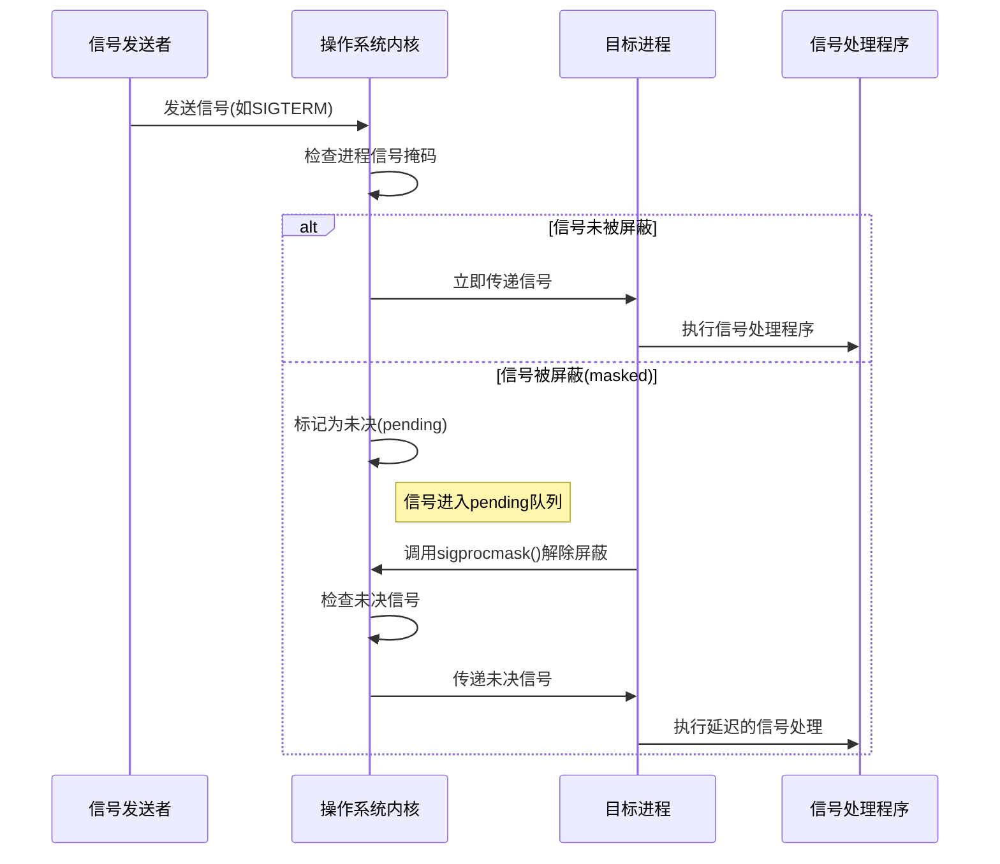

# 进程

## 1.基本知识

* 进程标识符pid
* 进程的产生

## 


# systemV的IPC对象

## 1.MSG（消息队列）


# 并发

同步：顺序执行，任务之间强耦合，线性，可预测

异步：独立执行，任务间弱耦合，事件的到来和结果不可知，非线性，事件驱动

异步事件的处理：查询法，通知法。

## 一、信号

#### 1.概念

信号是软件中断，指示进程发生了某种特定事件，

每个信号都有一个唯一的编号和名称，

信号的响应依赖于中断。

#### 2.`signal()`

* 注册当前信号的行为

* **信号会打断阻塞的系统调用**

  当程序执行一个阻塞的系统调用（如`read()`,`write()`,`sleep()`等时，如果此时进程收到一个未被忽略的信号，系统调用可能会被中断，并设置`errno`为`EINTER`

  * 处理`EINTER`

    * 自动重启被中断的系统调用

      ```c
      struct sigaction sa;
      sa.sa_handler = handler;
      sa.sa_flags = SA_RESTART;  // 自动重启被中断的系统调用
      sigemptyset(&sa.sa_mask);
      sigaction(SIGALRM, &sa, NULL);
      ```

      

    * 手动重试被中断的系统调用

      ```c
      // 手动重试 read()
      ssize_t n;
      do {
          n = read(fd, buf, size);
      } while (n == -1 && errno == EINTER);
      
      if (n == -1) {
          // 处理其他错误
          perror("read failed");
          exit(1);
      }
      ```

      

```c
#include <signal.h>
void (*signal(int signo, void (*func)(int)))(int)
```

**参数部分**

```c
signal(int signo, void (*func)(int))
```

`int signo`:要捕获的信号编号（如`SIGINT`、`SIGTERM`等）

`void (*func) (int)`:指向信号处理函数的指针，该函数接收一个`int`参数（信号编号），返回`void`

`func`的值是

* 常量`SIG_IGN`(向内核表示忽略该信号，但`SIGKILL`和`SIGSTOP`不能忽略),
* 常量`SIG_DFL`（系统默认动作）
* 接收到此信号后要调用的函数的地址

**返回值部分**

```c
void(* ... )(int)
```

* `signal()`的返回值是一个函数指针，指向一个接收`int`参数，返回`void`的函数
* 这个返回值实际上是之前的信号处理函数（用于恢复默认行为或链式处理）。

**简化理解**

```c
 #include <signal.h>

 typedef void (*sighandler_t)(int);
 sighandler_t signal(int signum, sighandler_t handler);
```


#### 3.信号的不可靠

信号的行为不可靠

* 当多个不同信号同时到达时，内核处理信号的顺序没有明确规范（依赖具体系统实现）
* 信号处理函数执行时，进程可能处于任意状态，可能打断正常逻辑。比如，处理信号时修改了主程序正在操作的全局变量，导致数据不一致
* 系统调用被中断
* 所以，仅将信号用于简单的异步通知，复杂的进程间通信应使用更可靠的机制（套接字，共享内存等）

#### 4.可重入函数

在执行过程中可以被安全中断并再次调用的函数

**可重入**：

* 函数在执行过程中被中断，并在中断返回后继续执行时，不会出现数据不一致或未定义行为
* 核心条件：
  1. **不依赖全局变量或静态数据**：所有数据都由参数传递或局部变量存储。
  2. **不修改自身代码**：函数体在执行期间保持不变。
  3. **不调用不可重入的函数**：避免调用标准库中的非线程安全函数（如`malloc`、`printf`）。

所有的系统调用都是可重入的，一部分库函数也是可重入的


#### 5.信号的响应过程

信号从收到到响应有一个不可避免的延迟

1. **信号的产生**

* 硬件异常
* 软件事件
* 内核通知

2. **信号的注册**

​	信号产生后，内核会为目标进程注册信号

​	**核心概念**

* **信号掩码（Signal Mask）**

  * 每个进程拥有的一个位掩码(bitmask),指定当前被阻塞的信号集合

  * **操作**：
    * `sigprocmask()`：设置或修改进程的信号掩码
    * `pthread_sigmask()`：线程级别的信号掩码操作

* **未决信号（Pending Signals）**

  * 已经发送给进程但尚未被处理的信号

* 信号掩码（Signal Mask）检查

  *  内核首先检查目标进程的阻塞掩码（Blocked Mask），该掩码存储了被进程暂时阻塞的信号（通过`sigprocmask()`设置）

  * 若信号被阻塞：信号不会立即递送，而是在内核中被标记为“pending”（待处理），直到掩码接触

  * 若信号未被阻塞：进入下一步

* 信号队列处理
  * 非实时信号：内核使用一个位图（每位对应一个信号）记录信号是否到达。若同一非实时信号多次发送，仅记录依次（后续信号丢失）
  * 实时信号：内核维护一个信号队列，相同信号可按发送顺序排队，不会丢失（队列长度受系统限制）

3. **信号的递送**

   当以下信号满足条件时，内核将信号递送给目标进程

   * 信号未被阻塞
   * 进程从内核态返回用户态

   **信号递送时的关键操作**

   * 内核修改进程的上下文，准备执行信号处理逻辑
   * 若进程设置了自定义信号处理函数，控制权将转移至该函数；否则执行默认动作

4. **信号的处理**

   信号到达后，进程根据信号处置执行相应操作

   * 默认动作
   * 忽略信号
   * 捕获并处理

5. 信号处理函数的执行流程

   1. 进程从用户态切换到内核态。

   2. 内核保存当前上下文（如寄存器值）。

   3. 内核设置栈帧，准备执行处理函数。

   4. 控制权转移至用户态的信号处理函数。

   5. 处理函数执行完毕后，通过 `sigreturn()` 系统调用返回内核态。

   6. 内核恢复原始上下文，进程继续执行被中断的代码。




* **如何忽略掉一个信号**

* **标准信号为什么要丢失**

* 标准信号的响应没有严格的顺序

  

#### 6.常用函数

* ##### `kill()`

  向指定进程或进程组发送信号

  

* ##### `raise()`

* ##### `alarm()`

* ##### `pause()`

* ##### `absort()`

* ##### `system()`

* ##### `sleep()`

#### 7.信号集

#### 8.信号屏蔽字/pending集的处理

#### 9.扩展

* `sigsuspend()`
* `sigaction()`
* `setitimer()`

#### 10.实时信号

## 二、线程

#### 1.概念

* 线程是一个正在运行的函数，多核处理器下操作系统可以将多个线程调度到不同的CPU中实现并行加速

* 线程是一种轻量级进程，依附于进程存在，进程中至少有一个线程。


* 系统分配资源的最小单位:进程；系统调度的最小单位：线程。


* 进程就像一个容器，容器承载多个线程。进程为线程提供资源环境，线程是进程的运行时。
* 线程之间共享地址空间和进程资源，且其本身拥有独立的PCB，

注：

1.posix线程是一套标准，而不是具体实现。比如线程标识：`pthread_t`，这只是一个标识，具体是结构体还是整形数，由开发者自己实现。

编译时需要在makefile加上选项(GCC进行默认编译时不用)

```
CFLAGES+=-pthread
LDFLAGS+=-pthread
```

2.线程的ID用`pthread_t`类型表示

```
pthread_equal();//比较线程标识
pthread_self(); //返回当前线程标识
```

3.现代主流操作系统中，线程和进程实现已经明确分离，但在Linux中，`clone()`系统调用是更底层的实现，`fork()`和线程创建都基于`clone()`,但传递不同的标志参数。


#### 2.创建，终止，栈的清理，取消选项

所有以`pthread_xxx`开头的线程函数，成功一律返回0，失败一律返回错误码


##### 1）创建线程

* 创建函数

```c
#include <pthread.h>
int pthread_create(pthread_t *thread, /*线程标识*/
					const pthread_attr_t *attr,   /*线程属性*/
					void *(*start_routine)(void *) /*线程函数*/
					void *arg /* 线程函数的参数*/) 
```

* 线程的调度取决于调度器策略，主线程推出后其他线程也会一并退出。


##### 2)线程的终止

* 线程从启动例程返回，返回值就是线程的退出码

* 线程可以从被同一进程中的其他线程取消

* 线程调用`pthread_exit();`

  * 如果任意线程调用了`exit`，那整个进程将会终止。

  * ```c
    #include <pthread.h>
    void pthread_exit(void *rval_ptr);/*rval_ptr:指向任意类型数据作为返回值*/
    ```

* `pthread_join()`和`pthread_detach()`

  * ```c
    #include <pthread.h>
    int pthread_join(pthread_t thread, void **retval);/*阻塞某个线程直到本线程结束，返回值存储在rval_ptr*/
    int pthread_detach(pthread_t thread);/*分离指定线程，此线程推出后自动释放资源而不会造成其他线程的阻塞*/
    ```

##### 4）栈的清理

线程退出时可以指定析构函数，并且可以以栈的方式指定多个析构函数及其执行顺序

```c
#include <pthread.h>

void pthread_cleanup_push(void (*routine)(void *), void *arg);
void pthread_cleanup_pop(int execute);
```

`push`:压入一个析构函数`routine`,参数时`arg`

`pop`:`execute`为1时使对应顺序的函数生效，为0时使之无效

两个函数实际是由宏来实现的，并且`push`展开后包含`{`，`pop`展开后包含`}`，故`push`和`pop`之间可以包含任意代码，但要求必须成对出现，否则会报错花括号未闭合

##### 4）取消选项

线程之间可以借助函数来取消某个线程

```c
#include <pthread.h>

int pthread_cancel(pthread_t thread);/*发送取消信号给指定线程*/ 
int pthread_setcancelstate(int state, int *oldstate);/*设置此线程是否允许取消*/
int pthread_setcanceltype(int type, int *oldtype);/*设置取消的方式，如异步，推迟等*/
void pthread_testcancel(void);/*在本位置设置一个取消点*/
```


```c
#include <stdio.h>
#include <pthread.h>

static void* func(void* p){
    puts("Thread is working!");
    pthread_exit(NULL);
    return NULL;
}

int main(){
	pthread_t tid;
    int err;
    puts("Begin!");
    err = pthread_create(&tid, NULL, func, NULL);
    if(err){
        fprintf(stderr, "pthread_create():%s\n", strerror(err));
        exit(1);
    }
    puts("End!");
    exit(0);
	
}
```


## 同步互斥

### 1）互斥锁与读写锁

* 互斥是控制两个进度使之互相排斥，不同时运行
* 同步是控制两个进度使之有先有后，次序可控

#### 互斥锁

* ##### 创建, 初始化与销毁

  ```c
  #include <pthread.h>
  pthread_mutex_t mutex = PTHREAD_MUTEX_INITIALIZER/*静态初始化*/
  int pthread_mutex_init(pthread_mutex_t *restrict mutex, 
                         const pthread_mutexattr_t *restrict attr);/*动态初始化*/
  int pthread_mutex_destroy(pthread_mutex_t *mutex);  /*销毁*/  
  ```

  * 静态初始化互斥锁不涉及动态内存，无需显式释放互斥锁资源（无需手动销毁），互斥锁将伴随程序一直存在，直到程序退出
  * 动态初始化给互斥锁分配动态内存并赋予初始值，互斥锁需要在用完之后显式的进行释放资源（销毁）

* ##### 加锁解锁

```c
#include <pthread.h>

int pthread_mutex_lock(pthread_mutex_t *mutex);/*阻塞式锁定*/
int pthread_mutex_trylock(pthread_mutex_t *mutex);/*非阻塞加锁*/
int pthread_mutex_unlock(pthread_mutex_t *mutex);

```

加锁解锁时机的判断：

* 操作变量时是否时共享的，是否会造成读写冲突
* 在临界区内找到所有可能跳出临界区的位置并在其中对锁进行处理

##### 基本阻塞流程

1. 尝试获取锁
   * 线程调用`pthread_mutex_lock()`尝试获取互斥锁
   * 如果锁当前可用（未被其他线程持有），线程立即获取锁并继续执行
   * 如果锁已被其他线程持有，线程进入阻塞状态（）
2. 阻塞状态
   * 线程被移出CPU调度队列
   * 线程状态从“运行”变为“阻塞”
   * 操作系统将线程添加到该互斥锁的等待队列
   * 阻塞的线程处于睡眠状态，不会占用CPU时间片，直到被唤醒
3. 唤醒过程
   * 当持有锁的线程调用`pthread_mutex_unlock()`释放锁时
   * 操作系统从等待队列中选择一个线程（选择策略因实现而异）
   * 被选中的线程从阻塞变为就绪
   * 当CPU调度器选择该线程时，它重新尝试获取锁

#### 读写锁

读操作可以多任务并发执行，只有写操作才能进行恰当的互斥

* ##### 初始化销毁解锁

  ```c
  #include <pthread.h>
  
  // 静态初始化：
  pthread_rwlock_t rw = PTHREAD_RWLOCK_INITIALIZER;
  
  // 动态初始化与销毁：
  int pthread_rwlock_init(pthread_rwlock_t *restrict rwlock,
                          const pthread_rwlockattr_t *restrict attr);
  
  int pthread_rwlock_destroy(pthread_rwlock_t *rwlock);
  int pthread_rwlock_unlock(pthread_rwlock_t *rwlock);
  ```

  * 多条线程可以对同一个读写锁加多重读锁
  * 多条线程只能有一个拥有写锁
  * 读锁与写锁也是互斥的

  ### 条件变量

  条件变量是一种线程同步机制，它给多个线程提供一个汇合的场所，允许线程以无竞争的方式等待某个特定条件的发生，并在条件可能满足时被唤醒，条件变量本身需要由互斥锁保护

  ##### 初始化，销毁

  ```c
  #include <pthread.h>
  
  pthread_cond_t cond = PTHREAD_COND_INITIALIZER;
  int pthread_cond_init(pthread_cond_t *restrict cond, const pthread_condattr_t *restrict attr);
  int pthread_cond_destroy(pthread_cond_t *cond);
  ```

  ##### 阻塞

  ```c
  #include <pthread.h>
  
  //阻塞当前线程并将其放入等待队列中，然后等待条件变量cond
  int pthread_cond_wait(pthread_cond_t *restrict cond, 
                        pthread_mutex_t *restrict mutex);
  
  /*阻塞当前线程并将其放入等待队列中，然后等待条件变量cond，
  并设置一个实现abstime,超时后不再等待并返回ETIMEOUT*/
  int pthread_cond_timedwait(pthread_cond_t *restrict cond, 
                             pthread_mutex_t *restrict mutex, 
                             const struct timespec *restrict abstime);
  ```

  * `*restrict`关键字表示在该指针的生命周期内，其指向的对象不会被别的指针所引用。有利于编译优化

    **`pthread_cond_wait()`的原子操作**（“释放锁+进入等待”是原子操作）

    1. 释放互斥锁：**立即解锁关联的互斥锁**
    2. 进入等待状态：线程被添加到条件变量的等待队列
    3. 阻塞线程：线程进入阻塞状态，不消耗CPU资源
    4. 等待信号：线程在条件变量上休眠，直到被唤醒
  
    

  ##### 唤醒

  ```c
  #include <pthread.h>
  
  /*唤醒所有正在等待条件变量cond的线程*/
  int pthread_cond_broadcast(pthread_cond_t *cond);
  
  /*唤醒正在等待条件变量cond所有线程中的一个*/
  int pthread_cond_signal(pthread_cond_t *cond);
  ```
  
  当其他线程调用`pthread_cond_signal(&cond)`时：

  1. 检查等待队列：如果有线程在等待
  2. 唤醒一个线程：选择队列中的一个线程唤醒（具体策略取决于实现）
  3. 标记为可运行：操作系统将线程状态改为就绪
  4. 线程尝试重新获取锁：当被唤醒的线程获得CPU时间后，它首先尝试重新获取关联的互斥锁


